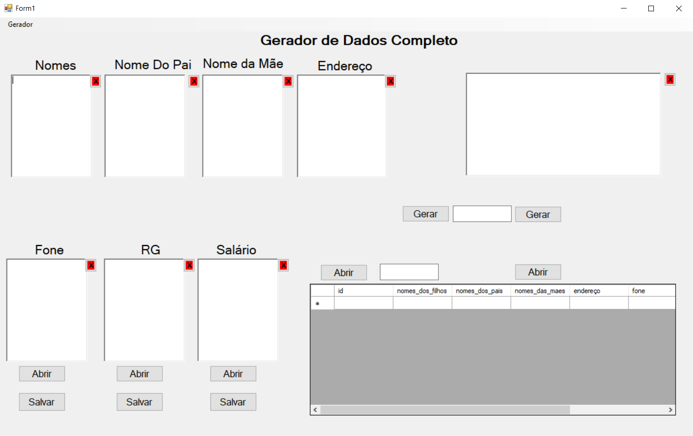

# Gerador De Dados Em Massa

## Tecnologias

Esse projeto foi desenvolvido com as seguintes tecnologias:

- [C#](https://docs.microsoft.com/en-us/dotnet/csharp/)
- [SQL Lite](https://www.sqlite.org/index.html)
- [SQL Server](https://www.microsoft.com/pt-br/sql-server/sql-server-downloads)

## Projeto

Projeto desenvolvido no curso técnico de informática da ETEC. Programa com intuito de popular bancos de dados SQLite ou SQL Server para realização de testes. Os dados de nome e sobrenome são gerados por meio de arquivos de texto com as nomes aleátorios.

## Licença

Esse projeto está sob a licença MIT. Veja o arquivo [LICENSE](LICENSE.md) para mais detalhes
